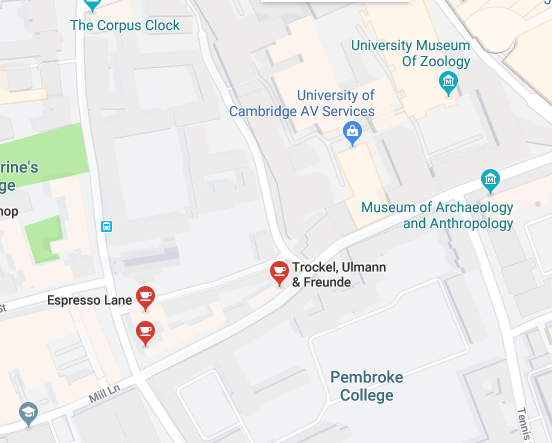
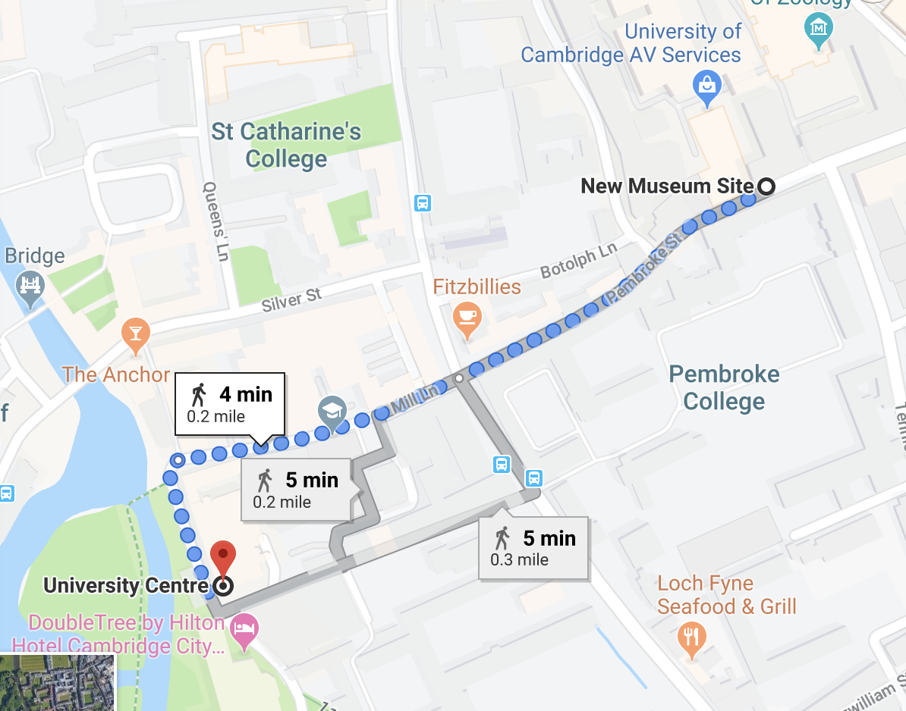

# C++ Course Cambridge 2019-04-16

Course website: <https://epcced.github.io/2019-04-16-ModernCpp/>

Source available: <https://github.com/EPCCed/2019-04-16-ModernCpp>

# Practicalities

## Catering

Coffee - sadly not provided



Lunch - we will provide a voucher for lunch at the University Centre


## Cirrus access

If you are having timeout issues on Cirrus, try

```
ssh trainXXX@login.cirrus.ac.uk
```

