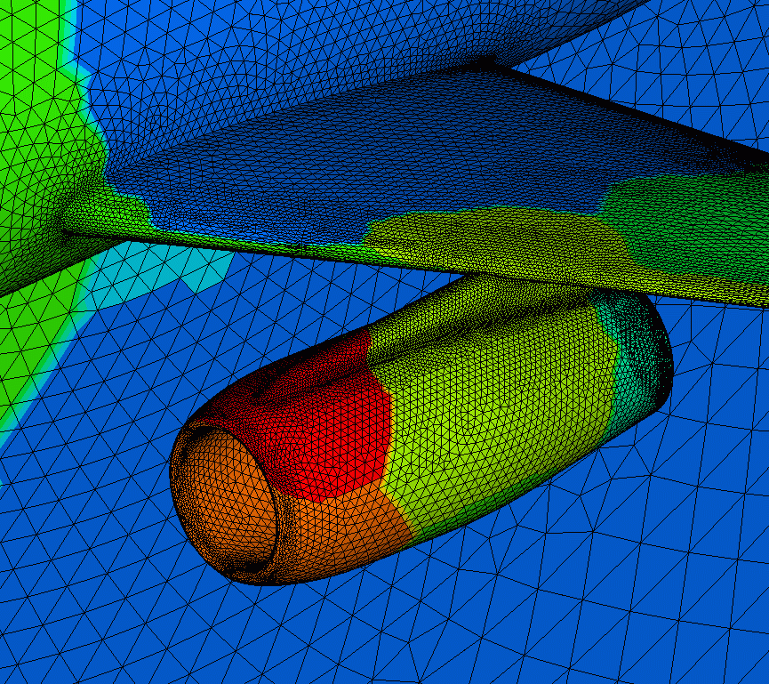

template: titleslide

# Containers and iterators
## Rupert Nash
## r.nash@epcc.ed.ac.uk

---
template:titleslide
# Containers

---
# STL Containers

The standard library has 13 container template classes, but we'll only touch on a few.

-   `vector` - a dynamically sized contiguous array

-   `array` - a statically size contiguous array

-   `list`/`forward_list` - a doubly/singly linked list

-   `set` / `map`

---
# vector - your new best friend

You will be using this a lot, because the elements are contiguous in memory.

```C++
#include <vector>

std::vector<int> primes(unsigned n) {
  std::vector<int> ans;
  for (auto i=2; i<n; ++i) {
    if (isprime(i))
      ans.push_back(i);
  }
  return ans
}
```


---
# vector - your new best friend

Supports:

-   copy

-   move

-   random element access by index

-   resize (and pre-reserving memory)

-   element insertion

-   element deletion

Note that when it destructs, contained elements will also be destroyed
(i.e. it *owns* them).

Also be aware that resizes may force reallocation and copying!

---
# array

-   Contiguous in memory but the size is fixed at compile time.

-   Almost like a vector, but you can't change the size.

-   Only difference is construction:

```C++
#include <array>
typedef std::array<int, 3> GridPoint;

GridPoint p1 = {1,2,3};
GridPoint p2{{5,2,5}};
// horrible extra brace can go in C++14
std::cout << p2.size() << std::endl;
// Prints 3
```

---
# list (and forward_list)

-   Almost always implemented as a doubly (singly) linked list.

-   Elements are allocated one by one on the heap. Traversal requires
    pointer chasing.

-   Fast element insertion and deletion (if you don't have to look for
    the element!)


---
# set and map

-   These are associative containers implemented as sorted data
    structures for rapid search.

-   `set` is just a set of keys, `map` is a set of key/value pairs
    (types can differ).

-   You must have defined a comparison function for the key type.


---
# set and map

For example, describing your communication pattern between MPI ranks with a domain decomposed problem

.center[

]

---
# set and map
```C++
std::map<int, BoundaryComm> rank2comms;
for (auto p =0; p != MPI_COMM_SIZE; ++p) {
  if (ShareBoundaryWithRank(p)) {
    rank2comms[p] = BoundaryComm(my_rank, p);
  }
}
// later
for (auto iter = rank2comms.begin(),
          end = rank2comms.end();
     iter != end; ++iter) {
  auto& bc = iter->second;
  bc->SendData(local_data);
}
```

---
# Guidelines

> Each container has its traits  
> That define the places where they are great  
> Particularly vector  
> You don't need a lecture  
> Just use vector  

> Where choosing a container, remember vector is best  
> Leave a comment to explain if you choose from the rest  

Credit - [Tony van Eerd](https://twitter.com/tvaneerd) @ [CppCon 2017](https://youtu.be/QTLn3goa3A8?t=332)

---
template:titleslide
# Iterators

---
# Iteration

C programmers are used to:
```C++
unsigned n = 100;
double* data = GetData(n);
for (auto i=0; i != n; ++i) {
  data[i] *= 2;
}
```

More old-skool C programmers will prefer this:
```C++
unsigned n = 100;
double* start = GetData(n);
double* stop = start + n;
for (auto ptr = start; ptr != stop; ++ptr) {
  *ptr *= 2;
}
```

---
# Iteration

These three humble pointers can implement the concept of traversing
every element in the array (in order).

They also model the concept of an **iterator** which is a vital for
using the standard library effectively.

There are a few different categories of iterator (forward, backward,
random, etc) but they all can traverse the elements of something
(e.g. a container, data in a file, input from keyboard) and provide
access to them.

---
# Iteration
A C++ equivalent of the previous might be:

```C++
std::vector<double> data = GetData(n);
for (std::vector<double>::iterator iter = data.begin();
     iter != data.end();
     ++iter) {
  *iter *= 2;
}
```

--

Or equivalently

```C++
std::vector<double> data = GetData(n);
for (auto iter = data.begin();
     iter != data.end(); ++iter) {
  *iter *= 2;
}
```

---
# Er why?

What do we gain? Separation of concerns!

We can separate the data and how it's stored from the way we're
traversing it, and also from the operations we apply to it.

--
```C++
template <class ItT>
void doubleInPlace(ItT start, ItT end) {
  for (auto iter = start; iter != end; ++iter)
    *iter *= 2;
}

std::vector<double> data = GetData(100);
doubleInPlace(data.begin(), data.end());

std::list<HugeMatrix> mats = GetMatrices();
doubleInPlace(mats.begin(), data.end());
```

---
# Container iterators

All the STL containers contain two iterator types, for example:

-   `std::list<char>::iterator` - instance must be non-`const` - get
    with `begin()` or `end()`.

-   `std::list<char>::const_iterator` - if the instance is `const` you
    get one of these from `begin()`/`end()`, if non-const, you can get
    one with `cbegin()`/`cend()`.


You can also get iterators from e.g. `std::map<KeyT, ValT>::find(search_key)`, which will give and iterator pointing to the element you want or to the `end()`.

Note that an iterator pointing to the end is not valid! Dereferencing
has undefined behaviour.

---
# Implementing your own iterator

To define your own iterator, you need to create a class with several
operator overloads (exactly which ones depends on the category of
iterator you need).

-   derefence operator (`*it`) - you have to be able to get a value
    (either to read or write)

-   pre-increment (`++it`) - you have to be able to go to the next
one


-   assigment - you need to bind it to name

-   inequality comparison (`it `= end!) - you need to know when you are
done


---
# Range for loop

Any type with `begin()` and `end()` member functions that return
iterators can be used in a range based for-loop.

```C++
std::vector<int> primes = getPrimes(5);
for (auto p : primes) {
  std::cout << p << " ";
}
std::cout << std::endl;
// 2 3 5 7 11 
```

Almost "pythonic"?

---
# Range for loop
The compiler will translate this for us into something
approximating the following

```C++
{
  auto&& _range = <range expression>; 
  for (auto _begin = _range.begin(),
            _end = _range.end();
       _begin != _end;
       ++_begin) {
    <range declaration> = *_begin;
    <loop body>
  }
}
```

---
# Is there any overhead?

Going to quickly compare three implementations

-   C-style array indexing

-   Standard vector with iterator

-   Standard vector with range based for-loop

```C++
int main(int argc, char** argv) {
  int size = std::atoi(argv[1]);
  std::vector<float> data(size);
  for (auto& el: data)
    el = rand(1000);
  Timer t;
  scale(data.data(), data.size(), 0.5);
  std::cout << size << ", " 
            << t.GetSeconds() << std::endl;
}
```

---
# Results
.center[]

---
# Results
.center[]

---
# Assembly

Just showing the main loops:
.columns[
.col[
C-style loop:

```x86asm
LBB4_6:
    movups  -16(%rdx), %xmm2
    movups  (%rdx), %xmm3
    mulps   %xmm1, %xmm2
    mulps   %xmm1, %xmm3
    movups  %xmm2, -16(%rdx)
    movups  %xmm3, (%rdx)
    addq    $32, %rdx
    addq    $-8, %rcx
    jne LBB4_6
```
]

.col[
Range-based loop:
```x86asm
LBB4_5:
    movups  (%rax,%rsi,4), %xmm2
    movups  16(%rax,%rsi,4), %xmm3
    movups  32(%rax,%rsi,4), %xmm4
    movups  48(%rax,%rsi,4), %xmm5
    mulps   %xmm1, %xmm2
    mulps   %xmm1, %xmm3
    movups  %xmm2, (%rax,%rsi,4)
    movups  %xmm3, 16(%rax,%rsi,4)
    mulps   %xmm1, %xmm4
    mulps   %xmm1, %xmm5
    movups  %xmm4, 32(%rax,%rsi,4)
    movups  %xmm5, 48(%rax,%rsi,4)
    addq    $16, %rsi
    addq    $2, %rdi
    jne LBB4_5
    ```
]
]
